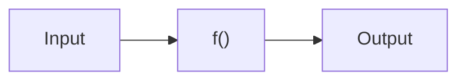

# 函数式编程

JavaScript函数式编程

<div class="uppercase text-sm tracking-widest">
Yvan Yang
</div>

<div class="abs-bl mx-14 my-12 flex">
  <div class="ml-3 flex flex-col text-left">
    <div class="text-sm opacity-50">Dec. 1st, 2021</div>
  </div>
</div>

---
name: 函数式编程
layout: center
---

<div class="grid grid-cols-[3fr,2fr] gap-4">
  <div class="text-center pb-4">
    
    <div class="opacity-50 mb-2 text-sm">
      主要内容
    </div>
  </div>
  <div class="border-l border-gray-400 border-opacity-25 !all:leading-12 !all:list-none my-auto">

  - 什么是函数式编程？
  - 为什么推荐函数式编程？
  - 高阶函数(higher-order function)
  - 闭包之函数柯里化(Currying)
  - 不变式(Immutability)
  - 纯之门路

  </div>
</div>

---
layout: image-left
image: ./jw_lambda.jpg
---

# 什么是函数式编程？

### 关键字

<v-clicks>

- 纯粹的(pure)
- 无状态(stateless)
- 副作用(side effect)
- 不可变(immutable)
- 高阶(higher-order)
- 柯里化(currying)
- 组合(compose)

</v-clicks>

---
layout: center
---

# 编程范式(Programming paradigm)[^1]

>编程范式是程序员看待程序应该具有的观点，代表了程序设计者认为程序应该如何被构建和执行的看法。

<br />

<div class="grid grid-cols-2 gap-x-4 gap-y-4">

<div>

### 命令式||过程式(Imperative)

- 跟随我的指令，先执行这个，再执行那个。。。

</div>

<div>

### 说明式||声明式(Declarative)

- 基于模板的 html，css

</div>

<div>

### 面向对象编程(Object-Oriented)

- 封装、继承、多态
- 有自己的状态

</div>

<div>

### 函数式编程（functional programming）

- 将计算描述为一种表达式求值

</div>

<div>

### 事件化编程

- 回调函数、事件循环（event loop）

</div>

</div>

[^1]: [再谈编程范式—程序语言背后的思想](https://imweb.io/topic/5cde5770e363b77a0edeb874)

---
layout: center
---

# 函数式编程之根---纯函数(pure functions)

<v-click>

- 如果函数的调用参数相同，则永远返回相同的结果。它不依赖于程序执行期间函数外部任何状态或数据的变化，必须只依赖于其输入参数。
- 该函数不会产生任何可观察的副作用，例如网络请求，输入和输出设备或数据突变（mutation）。

</v-click>

<v-after>



> 2句话总结：相同输入返回相同输出，没有改变外部的环境！

</v-after>

---
layout: image-right
image: https://source.unsplash.com/collection/94734531/1920x1080
---
# 为什么推荐函数式编程？

### 价值所在
<v-clicks>

- 更加可预测性
- 更易被测试/调试
- 更加可靠（幂等操作）

</v-clicks>

---
layout: image-right
image: https://source.unsplash.com/collection/94734561/1920x1080
---

# 纯与不纯


###### 不纯 ? or 纯 ?

```js
function getDate() {
  return new Date().toDateString();
}
```

<br />


###### 不纯 ? or 纯 ?

```js
function getDate (y, m, d) {
  return new Date(y, m, d).toDateString();
}
```

---

# 保持组件纯度

<iframe src="https://codesandbox.io/embed/sandpack-project-forked-8qtv3?fontsize=14&hidenavigation=1&theme=dark"
     style="width:100%; height:500px; border:0; border-radius: 4px; overflow:hidden;"
     title="sandpack-project (forked)"
     allow="accelerometer; ambient-light-sensor; camera; encrypted-media; geolocation; gyroscope; hid; microphone; midi; payment; usb; vr; xr-spatial-tracking"
     sandbox="allow-forms allow-modals allow-popups allow-presentation allow-same-origin allow-scripts"
   ></iframe>

---
layout: center
---

  

  <div class="text-center text-stroke-blue-500 p-4">
  <span>五香茶</span>
  </div>

---

# 似曾相识的副作用

<iframe src="https://codesandbox.io/embed/angry-perlman-nme4n?fontsize=14&hidenavigation=1&theme=dark"
     style="width:100%; height:500px; border:0; border-radius: 4px; overflow:hidden;"
     title="angry-perlman-nme4n"
     allow="accelerometer; ambient-light-sensor; camera; encrypted-media; geolocation; gyroscope; hid; microphone; midi; payment; usb; vr; xr-spatial-tracking"
     sandbox="allow-forms allow-modals allow-popups allow-presentation allow-same-origin allow-scripts"
   ></iframe>

[-] [Detecting unexpected side effects](https://reactjs.org/docs/strict-mode.html#detecting-unexpected-side-effects)
[-] [In StrictMode, the useState() initializer function is called twice](https://github.com/facebook/react/issues/20090#issuecomment-715927125)

---

# 高阶函数

- filter, map, reduce


---

# 闭包之函数柯里化

>将一个函数从可调用的`f(a, b, c)`转换为可调用的`f(a)(b)(c)`。

```js
function curry(func) {

  return function curried(...args) {
    if (args.length >= func.length) {
      return func.apply(this, args);
    } else {
      return function(...args2) {
        return curried.apply(this, args.concat(args2));
      }
    }
  };

}
```
---

# 例子

```js
function sum(a, b, c) {
  return a + b + c;
}

let curriedSum = curry(sum);

alert( curriedSum(1, 2, 3) ); // 6，仍然可以被正常调用
alert( curriedSum(1)(2,3) ); // 6，对第一个参数的柯里化
alert( curriedSum(1)(2)(3) ); // 6，全柯里化
```

---

# 不变式(Immutability)

### 写拷贝(Copy-on-Write)

<div class="grid grid-cols-2 gap-x-4 gap-y-4">

<div>

###### Original mutating version

<div v-click-hide>

```ts
function remove_item_by_name(cart, name) {
  let idx = null;
  for(let i = 0; i < cart.length; i++) {
    if(cart[i].name === name) {
      idx = i;
    }
  }
  if(idx !== null) {
    cart.splice(idx, 1);
  }
}
```

</div>

<div v-after>

```ts {9}
function remove_item_by_name(cart, name) {
  let idx = null;
  for(let i = 0; i < cart.length; i++) {
    if(cart[i].name === name) {
      idx = i;
    }
  }
  if(idx !== null) {
    cart.splice(idx, 1);
  }
}
```

</div>

</div>

<div>

###### Copy-on-write version

<div v-click-hide>

```ts
function remove_item_by_name(cart, name) {
  const new_cart = cart.slice();
  let idx = null;
  for(let i = 0; i < new_cart.length; i++) {
    if(new_cart[i].name === name) {
      idx = i;
    }
  }
  if(idx !== null) {
    new_cart.splice(idx, 1);
  }
  return new_cart;
}
```
</div>

<div v-after>

```ts {2,10,12}
function remove_item_by_name(cart, name) {
  const new_cart = cart.slice();
  let idx = null;
  for(let i = 0; i < new_cart.length; i++) {
    if(new_cart[i].name === name) {
      idx = i;
    }
  }
  if(idx !== null) {
    new_cart.splice(idx, 1);
  }
  return new_cart;
}
```
</div>

</div>


</div>

<style>
.slidev-vclick-hidden {
  opacity: 0;
  pointer-events: none;
  display:none;
}
</style>

---

# 纯之门路

### 来自Douglas Crockford的《JavaScript悟道》中对JavaScript的吐槽
* 首先，必须丢弃所有的赋值运算符，以及 var 和 let 语句，只保留 const 语句。我们通过
const 来初始化变量，并且不再改变它的值。
* 接着，需要丢弃可以修改对象内容的运算符和方法，如 delete 运算符和 Object.assign
方法等；还要抛弃可以更改数组内容的方法，如 splice 和 sort 等。
* for 语句的原始意图就是修改归纳变量，所以也要被丢弃。同理，我们还要丢弃 while 和
do。尾递归才是最纯的迭代方式。
* 然后，我们还要弃用 Date 构造函数。每次调用它都会得到不同的值，这就是不纯的一个表
现。同理，我们还应该弃用 Math.random，你甚至无法知道它的返回值会是什么。
* 最后，切断网线吧。

<br />

### 最终幻想：No Code[^2]
> No code is the best way to write secure and reliable applications. Write nothing; deploy nowhere.

[^2]: [No Code](https://github.com/kelseyhightower/nocode)

---
layout: center
class: 'text-center pb-5 :'
---

# Thank You!
